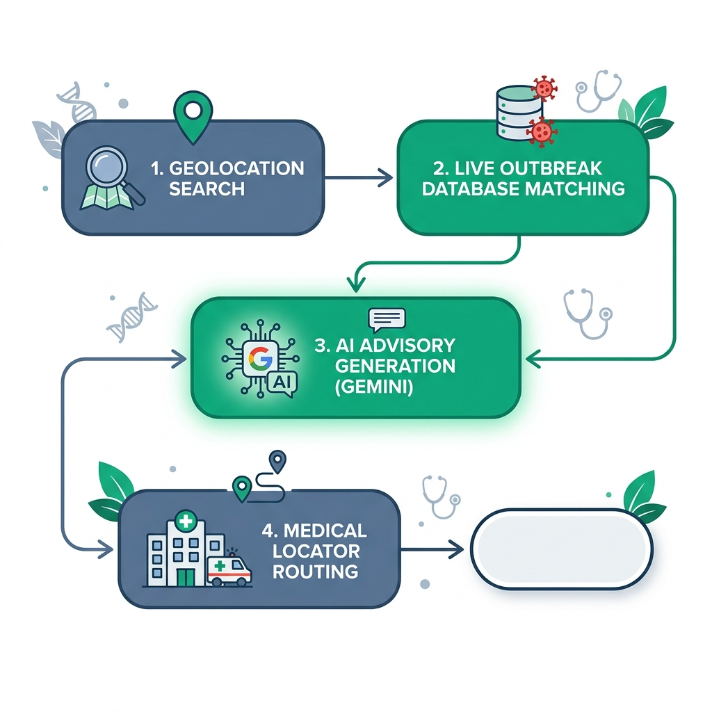
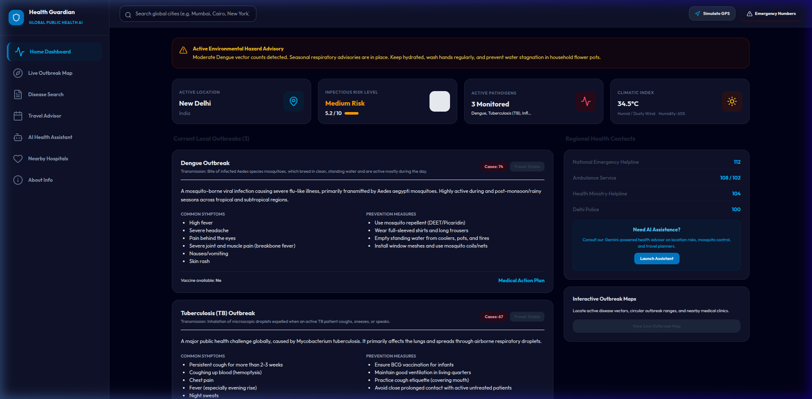
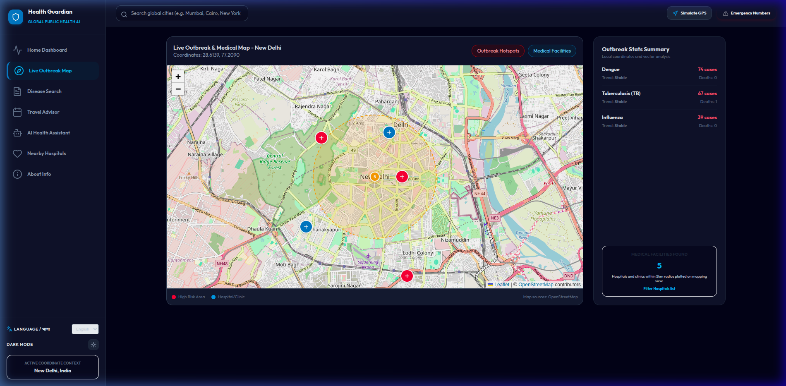
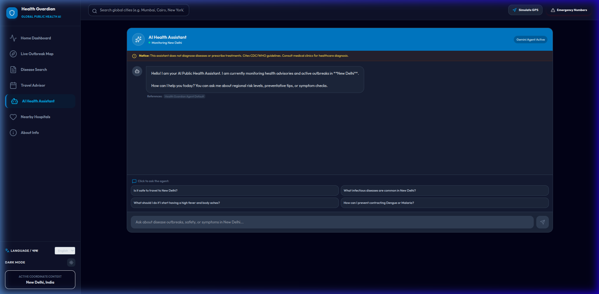
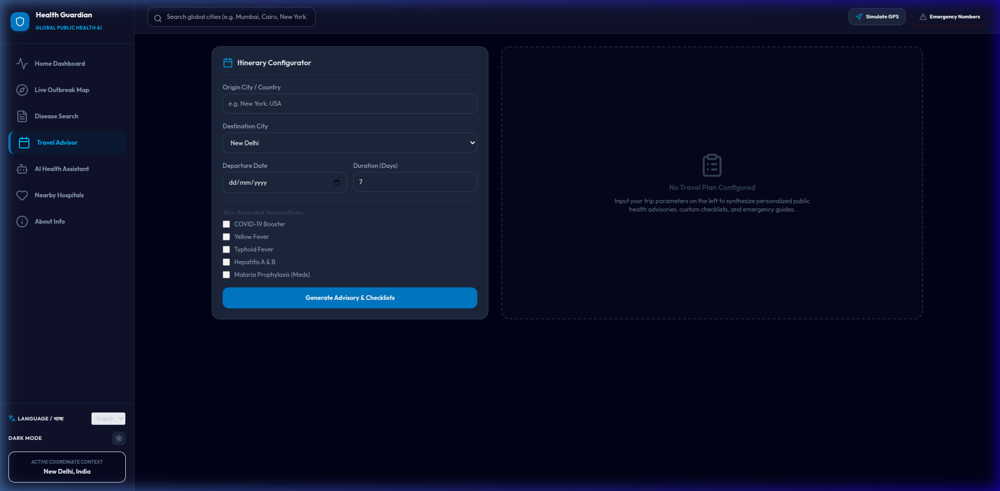

# Health Guardian AI 🛡️

Health Guardian AI is an AI-powered public health awareness assistant designed to help travelers and local residents understand infectious disease risks in their current location or travel destination.

Instead of presenting raw outbreak data, Health Guardian AI gathers relevant health information, analyzes potential risks, and provides clear, actionable recommendations to help users make informed decisions before and during travel.

> **Disclaimer:** Health Guardian AI is an educational decision-support tool and is **not** intended to replace professional medical advice, diagnosis, or treatment.

---

# Problem Statement

Every year, millions of people travel without being aware of infectious disease risks in their destination. Although organizations such as the WHO and national health agencies publish outbreak information, it is often scattered across multiple sources and difficult for the average person to interpret quickly.

Health Guardian AI addresses this challenge by combining location awareness, outbreak information, AI-generated explanations, and preventive guidance into a single easy-to-use application.

---

# AI Agent Workflow

The Health Guardian AI agent follows a simple decision-making workflow:

1. Receive the user's current location or travel destination.
2. Gather disease and outbreak information from available data sources.
3. Analyze potential health risks for that location.
4. Generate easy-to-understand preventive recommendations.
5. Suggest nearby healthcare facilities.
6. Present the information with an educational medical disclaimer.

---

## App Workflow Diagram



---

# Key Features

- 🌍 **Location-Based Disease Awareness**
  - View infectious disease information based on your current location or any searched destination.

- 🤖 **AI Health Assistant**
  - AI-powered assistant that explains disease risks, preventive measures, and travel health recommendations in simple language.
  - Supports Google Gemini with an offline simulator for development and testing.

- 🦟 **Disease Outbreak Monitoring**
  - Displays outbreak information for diseases such as Dengue, Malaria, Chikungunya, Leptospirosis, Typhoid, Tuberculosis, and other infectious diseases.

- 🗺️ **Interactive Outbreak Map**
  - Visualizes outbreak locations using Leaflet maps with intuitive risk indicators.

- 🏥 **Nearby Healthcare Facilities**
  - Locate nearby hospitals and healthcare centers using OpenStreetMap.

- ✈️ **Travel Health Advisor**
  - Provides destination-specific travel precautions, vaccination guidance (where applicable), and preventive checklists.

- 🌐 **Multilingual Support**
  - Available in English and Hindi.

- ☎️ **Emergency Information**
  - Displays regional emergency contact numbers where available.

---

## Tech Stack

**Backend**
- FastAPI
- Python 3.12+
- HTTPX
- Pydantic

**Frontend**
- React
- TypeScript
- Vite
- Tailwind CSS
- Leaflet
- Lucide Icons

**AI**
- Google Gemini (gemini-1.5-flash)
- Local AI simulator for offline development

---

## Getting Started

### Prerequisites
* **Node.js** v20.19+ or v22.12+
* **Python** 3.10+
* **Gemini API Key** (optional, fallback simulator is active)

### Backend Setup
1. Navigate to the backend directory:
   ```bash
   cd backend
   ```
2. Create a virtual environment and install dependencies:
   ```bash
   python3 -m venv venv
   source venv/bin/activate
   pip install -r requirements.txt
   ```
3. Copy `.env` to the project root and add your key:
   ```env
   GEMINI_API_KEY=your_google_gemini_key
   PORT=8000
   HOST=127.0.0.1
   ```
4. Run the development server:
   ```bash
   python run.py
   ```
   The backend starts on `http://127.0.0.1:8000`.

### Frontend Setup
1. Navigate to the frontend directory:
   ```bash
   cd frontend
   ```
2. Install npm dependencies:
   ```bash
   npm install
   ```
3. Start the Vite React server:
   ```bash
   npm run dev
   ```
   Open the browser at `http://localhost:5173`.

---

## Screenshots

### Home Dashboard



### Disease Map



### AI Assistant



### Travel Advisor


